  

  
# ✨ HYGIEIA ✨

### AI-Powered Medical Diagnostic Platform

<strong>Revolutionizing Healthcare Through Intelligent Technology</strong>

---

## 🌟 Project Overview

**Hygieia** is a comprehensive AI-powered healthcare platform that combines cutting-edge machine learning models with an intuitive user interface to provide accessible, accurate, and secure medical diagnostic services. Named after the Greek goddess of health, our platform embodies the mission of bringing advanced healthcare technology to everyone.

  
   
  <em>Hygieia - Where Technology Meets Healthcare</em>

### 🎯 Key Highlights

| Feature | Description |
|---------|-------------|
| 🧠 **5 AI Models** | Specialized diagnostic and predictive models |
| 📊 **96%+ Accuracy** | Clinical-grade machine learning predictions |
| 🔗 **Blockchain Verified** | Every analysis cryptographically secured |
| 🤖 **AI Health Assistant** | Dr. Hygieia - Context-aware medical guidance |
| 🌙 **Dark/Light Mode** | Beautiful, accessible interface |
| 📱 **Responsive Design** | Seamless experience across all devices |

---

## 🖼️ Interface Showcase

### Landing Page - Hero Section

  
   
  <em>A welcoming, professional landing page that introduces users to Hygieia's capabilities</em>

The hero section features:
- **Dynamic gradient backgrounds** with subtle animations
- **Clear value proposition** - "Your Health, Our Priority"
- **Quick access cards** to all 5 diagnostic services
- **Trust indicators** showing model accuracy rates
- **Call-to-action buttons** for immediate engagement

---

### User Authentication

  
   
  <em>Secure, elegant authentication experience</em>

#### Features:
- ✅ **Clean, minimal design** - Focused user experience
- ✅ **Form validation** - Real-time input validation
- ✅ **JWT Authentication** - Secure token-based auth
- ✅ **Remember me option** - Convenient return visits
- ✅ **Password strength indicator** - Security awareness
- ✅ **Social cues** - Professional healthcare imagery

---

### Dashboard - Command Center

  
   
  <em>Personalized dashboard with quick access to all features</em>

The dashboard provides:

| Section | Functionality |
|---------|---------------|
| **Welcome Banner** | Personalized greeting with user's name |
| **Quick Actions** | One-click access to all 5 analysis types |
| **Recent Analyses** | Latest health assessments at a glance |
| **Statistics** | Visual breakdown of analysis history |
| **Activity Timeline** | Track health monitoring journey |

#### Analysis Quick Cards:

```mermaid
flowchart TB
    subgraph row1[" "]
        direction LR
        A["❤️ Heart<br/>Risk<br/>Prediction"]
        B["💧 Diabetes<br/>Risk<br/>Prediction"]
        C["🔬 Skin<br/>Diagnosis"]
    end
    
    subgraph row2[" "]
        direction LR
        D["🎀 Breast<br/>Cancer Risk<br/>Prediction"]
        E["🎀 Breast<br/>Tissue<br/>Diagnosis"]
    end
    
    row1 --> row2
    
    style A fill:#fee2e2,stroke:#dc2626,color:#000
    style B fill:#ffedd5,stroke:#ea580c,color:#000
    style C fill:#ccfbf1,stroke:#0d9488,color:#000
    style D fill:#fce7f3,stroke:#db2777,color:#000
    style E fill:#f5d0fe,stroke:#a855f7,color:#000
```

---

### Analysis Interface

  
   
  <em>Intuitive analysis forms with real-time validation</em>

#### Analysis Features:

- 📝 **Dynamic Forms** - Context-aware input fields
- ✅ **Real-time Validation** - Immediate feedback on inputs
- 📖 **Helper Text** - Guidance for medical parameters
- 📤 **Image Upload** - For skin lesion analysis
- 📊 **Progress Indicators** - Visual feedback during processing
- 🔄 **Auto-save** - Never lose your progress

#### Supported Analysis Types:

| Type | Icon | Accuracy | Parameters |
|------|------|----------|------------|
| Heart Risk Prediction | ❤️ | 99.4% | 18 clinical parameters |
| Diabetes Risk Prediction | 💧 | 98.1% | Symptom-based analysis |
| Skin Lesion Diagnosis | 🔬 | 96.8% | AI image analysis |
| Breast Cancer Prediction | 🎀 | 81.3% | 10 risk factors |
| Breast Tissue Diagnosis | 🎀 | 97.2% | 30 FNA measurements |

---

### Analysis Results

After completing an analysis, users receive comprehensive results:

```mermaid
block-beta
    columns 1
    
    block:header:1
        title["📊 ANALYSIS RESULT"]
    end
    
    block:risk:1
        columns 1
        r1["RISK ASSESSMENT"]
        r2["████████████████░░░░░░░░ 65%"]
        r3["⚠️ MODERATE RISK"]
        r4["Confidence: 94.2% | Model: v2.0"]
    end
    
    block:ai:1
        columns 1
        a1["🤖 AI SUMMARY"]
        a2["Your analysis indicates a moderate risk level.<br/>Based on the parameters provided, there are<br/>some factors that warrant attention..."]
        a3["💬 Chat with Dr. Hygieia"]
    end
    
    block:blockchain:1
        columns 1
        b1["🔗 BLOCKCHAIN VERIFICATION"]
        b2["Hash: 0x7a3f...8c2d | Block: #1042"]
        b3["✅ Verified"]
    end
    
    style title fill:#3b82f6,color:#fff
    style r3 fill:#fbbf24,color:#000
    style b3 fill:#22c55e,color:#fff
```

#### Result Components:

- 📊 **Visual Risk Meter** - Easy-to-understand risk visualization
- 🏷️ **Risk Classification** - Low / Moderate / High / Critical
- 📈 **Confidence Score** - Model certainty level
- 🤖 **AI-Generated Summary** - Human-readable explanation
- 🔗 **Blockchain Hash** - Immutable verification
- 💬 **Chat Integration** - Direct link to discuss results

---

### Dr. Hygieia - AI Health Assistant

  
   
  <em>Context-aware AI assistant for personalized health guidance</em>

#### Chat Features:

| Feature | Description |
|---------|-------------|
| **Context Awareness** | Knows your analysis history |
| **Multi-Session** | Multiple concurrent conversations |
| **Streaming Responses** | Real-time message generation |
| **Session Management** | Save, rename, delete conversations |
| **Analysis Integration** | Direct chat about specific results |

#### Conversation Flow:

```mermaid
sequenceDiagram
    participant U as 👤 User
    participant D as 🤖 Dr. Hygieia
    
    D->>U: Hello! I'm Dr. Hygieia, your AI health assistant.<br/>I've reviewed your recent Heart Risk analysis<br/>from January 10, 2026.
    D->>U: Your analysis showed a MODERATE risk level<br/>with 94.2% confidence. Based on the parameters<br/>you provided, here's what this means...
    
    U->>D: What lifestyle changes could help reduce my risk?
    
    D->>U: Great question! Based on your specific parameters,<br/>here are evidence-based recommendations:
    
    Note right of D: 🏃 Regular physical activity<br/>🥗 Heart-healthy diet<br/>😴 Quality sleep
    
    D->>U: Remember, please consult with your healthcare<br/>provider for personalized medical advice.
```

---

### Blockchain Verification

  
   
  <em>Immutable record verification system</em>

#### Blockchain Features:

- 🔐 **Cryptographic Hashing** - SHA-256 verification
- 📜 **Audit Trail** - Complete analysis history
- ✅ **Tamper Detection** - Automatic integrity validation
- 🔗 **Chain Validation** - Full blockchain verification
- 📊 **Admin Dashboard** - Complete oversight tools

#### Block Structure:

```mermaid
block-beta
    columns 1
    
    block:header
        h1["🔗 BLOCK #1042"]
    end
    
    block:hashes
        columns 2
        h2["Previous Hash"]
        h3["0x8f2c3a1b..."]
        h4["Current Hash"]
        h5["0x7a3f8c2d..."]
        h6["Timestamp"]
        h7["2026-01-10T14:32:15Z"]
        h8["Nonce"]
        h9["48721"]
    end
    
    block:payload
        columns 2
        p1["📦 PAYLOAD"]:2
        p2["Analysis ID"]
        p3["uuid-1234..."]
        p4["Type"]
        p5["heart-prediction"]
        p6["User ID"]
        p7["uuid-5678..."]
        p8["Result Hash"]
        p9["0x4f2a..."]
        p10["Model Version"]
        p11["2.0.1"]
    end
    
    block:status
        s1["✅ VERIFIED"]
    end
    
    style h1 fill:#8b5cf6,color:#fff
    style p1 fill:#3b82f6,color:#fff
    style s1 fill:#22c55e,color:#fff
```

---

### Contact & Support

  
   
  <em>Easy access to support and information</em>

---

## 🏗️ Technical Architecture

### System Overview

```mermaid
flowchart TB
    subgraph Frontend["🖥️ FRONTEND - Next.js 14"]
        direction LR
        F1["📄 Pages<br/>Router"]
        F2["🧩 Components<br/>Library"]
        F3["📦 State<br/>Zustand"]
        F4["🔌 API<br/>Client"]
    end
    
    Frontend -->|"REST API / JWT"| Backend
    
    subgraph Backend["⚙️ BACKEND - Flask"]
        direction TB
        
        subgraph Routes["Routes"]
            direction LR
            R1["🔐 Auth<br/>Routes"]
            R2["📊 Analysis<br/>Routes"]
            R3["💬 Chat<br/>Routes"]
        end
        
        subgraph Services["Services Layer"]
            direction LR
            S1["Auth<br/>Service"]
            S2["Analysis<br/>Service"]
            S3["Blockchain<br/>Service"]
            S4["Chat<br/>Service"]
        end
        
        subgraph MLModels["🧠 ML Model Layer"]
            direction LR
            M1["❤️ Heart<br/>Model"]
            M2["💧 Diabetes<br/>Model"]
            M3["🔬 Skin<br/>Model"]
            M4["🎀 Breast<br/>Models"]
        end
        
        Routes --> Services
        Services --> MLModels
    end
    
    Backend --> Database
    
    subgraph Database["🗄️ DATABASE - PostgreSQL"]
        direction LR
        D1[("👤 Users")]
        D2[("📊 Analyses")]
        D3[("🔗 Blockchain<br/>Records")]
        D4[("💬 Chat<br/>Sessions")]
    end
    
    style Frontend fill:#dbeafe,stroke:#3b82f6
    style Backend fill:#fef3c7,stroke:#f59e0b
    style Database fill:#dcfce7,stroke:#22c55e
```

### Technology Stack

#### Frontend
| Technology | Purpose |
|------------|---------|
| **Next.js 14** | React framework with App Router |
| **TypeScript** | Type-safe development |
| **Tailwind CSS** | Utility-first styling |
| **Framer Motion** | Smooth animations |
| **TanStack Query** | Server state management |
| **Zustand** | Client state management |

#### Backend
| Technology | Purpose |
|------------|---------|
| **Flask** | Python web framework |
| **SQLAlchemy** | ORM for database |
| **JWT** | Authentication |
| **scikit-learn** | ML model training |
| **TensorFlow** | Deep learning (Skin model) |
| **Google Derm Foundation** | Medical image analysis |

---

## 🧠 AI Models Portfolio

### Model Performance Summary

| Model | Accuracy | ROC-AUC | Samples | Architecture |
|-------|----------|---------|---------|--------------|
| Heart Risk | **99.4%** | 99.9% | 303 | Stacking Ensemble |
| Diabetes Risk | **98.1%** | 99.6% | 520 | Random Forest + XGBoost |
| Skin Diagnosis | **96.8%** | 99.3% | 10,015 | CNN + Derm Foundation |
| Breast Risk | **81.3%** | 86.2% | 251,661 | Voting Ensemble |
| Breast Diagnosis | **97.2%** | 99.7% | 569 | Stacking Ensemble |

### Model Architecture Highlights

#### 🔬 Skin Lesion Diagnosis Model

```mermaid
flowchart TB
    subgraph Pipeline["🔬 SKIN DIAGNOSIS PIPELINE"]
        direction TB
        
        A["📷 Input Image"] --> B["🧠 Google Derm Foundation Model<br/><i>Pre-trained on clinical images</i>"]
        
        B --> C["📊 Feature Extraction<br/>6,144-dim Embeddings<br/>+ 80 Engineered Features"]
        
        C --> D1["XGBoost"]
        C --> D2["Random<br/>Forest"]
        C --> D3["Gradient<br/>Boosting"]
        C --> D4["Extra<br/>Trees"]
        
        D1 --> E["🗳️ Voting Ensemble<br/>+ Calibration"]
        D2 --> E
        D3 --> E
        D4 --> E
        
        E --> F["🎯 7-Class Output<br/>Skin Condition"]
    end
    
    style A fill:#e0f2fe,stroke:#0284c7
    style B fill:#fef3c7,stroke:#f59e0b
    style C fill:#f3e8ff,stroke:#a855f7
    style D1 fill:#dcfce7,stroke:#22c55e
    style D2 fill:#dcfce7,stroke:#22c55e
    style D3 fill:#dcfce7,stroke:#22c55e
    style D4 fill:#dcfce7,stroke:#22c55e
    style E fill:#fce7f3,stroke:#db2777
    style F fill:#dbeafe,stroke:#3b82f6
```

**Detectable Conditions:**
1. Actinic Keratoses
2. Basal Cell Carcinoma ⚠️
3. Benign Keratosis
4. Dermatofibroma
5. Melanoma ⚠️
6. Melanocytic Nevus
7. Vascular Lesions

---

## 🔒 Security Features

### Multi-Layer Security

```mermaid
flowchart TB
    subgraph Security["🔒 SECURITY LAYERS"]
        direction TB
        
        subgraph L1["Layer 1: Authentication"]
            direction LR
            A1["🔑 JWT Token-based auth"]
            A2["🔐 Bcrypt password hashing"]
            A3["📋 Session management"]
        end
        
        subgraph L2["Layer 2: Authorization"]
            direction LR
            B1["👥 Role-based access control"]
            B2["🛡️ Admin/User separation"]
            B3["✅ Resource ownership validation"]
        end
        
        subgraph L3["Layer 3: Data Protection"]
            direction LR
            C1["🧹 Input validation & sanitization"]
            C2["💉 SQL injection prevention"]
            C3["🚫 XSS protection"]
        end
        
        subgraph L4["Layer 4: Blockchain Verification"]
            direction LR
            D1["#️⃣ SHA-256 cryptographic hashing"]
            D2["📜 Immutable audit trail"]
            D3["🔗 Chain integrity validation"]
        end
        
        L1 --> L2 --> L3 --> L4
    end
    
    style L1 fill:#dbeafe,stroke:#3b82f6
    style L2 fill:#fef3c7,stroke:#f59e0b
    style L3 fill:#dcfce7,stroke:#22c55e
    style L4 fill:#f3e8ff,stroke:#a855f7
```

---

## 📊 Feature Summary

### User Features

| Feature | Status | Description |
|---------|--------|-------------|
| User Registration | ✅ | Secure account creation |
| Profile Management | ✅ | Edit personal information |
| Avatar Upload | ✅ | Custom profile pictures |
| Dark/Light Mode | ✅ | Theme preference |
| Analysis History | ✅ | Complete analysis records |
| AI Chat | ✅ | Dr. Hygieia assistant |

### Analysis Features

| Feature | Status | Description |
|---------|--------|-------------|
| Heart Risk Prediction | ✅ | 18-parameter cardiovascular assessment |
| Diabetes Risk Prediction | ✅ | Symptom-based risk evaluation |
| Skin Lesion Diagnosis | ✅ | AI-powered image analysis |
| Breast Cancer Prediction | ✅ | Clinical risk factors assessment |
| Breast Tissue Diagnosis | ✅ | FNA biopsy analysis |
| AI Summaries | ✅ | LLM-generated explanations |
| Blockchain Recording | ✅ | Immutable verification |

### Admin Features

| Feature | Status | Description |
|---------|--------|-------------|
| User Management | ✅ | View and manage all users |
| Analysis Monitoring | ✅ | Platform-wide analytics |
| Blockchain Audit | ✅ | Chain validation tools |
| Model Benchmarking | ✅ | Performance evaluation |
| Chat Oversight | ✅ | All conversation access |

---

## 🚀 Performance Metrics

### Application Performance

| Metric | Value |
|--------|-------|
| Initial Load Time | < 2s |
| Analysis Processing | < 3s |
| Chat Response (Streamed) | < 500ms first token |
| API Response Time | < 200ms average |

### Model Performance

| Model | Inference Time | Memory |
|-------|---------------|--------|
| Heart Risk | ~50ms | 12MB |
| Diabetes Risk | ~45ms | 10MB |
| Skin Diagnosis | ~200ms | 850MB |
| Breast Prediction | ~55ms | 15MB |
| Breast Diagnosis | ~50ms | 14MB |

---

## 🎨 Design Philosophy

### Visual Design Principles

1. **Clean & Professional** - Healthcare demands trust
2. **Accessible** - WCAG compliant design
3. **Intuitive** - Minimal learning curve
4. **Responsive** - All screen sizes supported
5. **Consistent** - Unified design language

### Color Palette

```mermaid
flowchart LR
    subgraph Primary["Primary Colors"]
        direction TB
        P1["🔵 Primary Blue<br/>Medical trust & professionalism"]
        P2["🟢 Success Green<br/>Positive results & safety"]
        P3["🟡 Warning Amber<br/>Attention & moderate risk"]
        P4["🔴 Danger Red<br/>High risk & critical alerts"]
    end
    
    subgraph Analysis["Analysis Type Colors"]
        direction TB
        A1["❤️ Heart Red<br/>Cardiovascular analysis"]
        A2["🧡 Diabetes Orange<br/>Metabolic health"]
        A3["💚 Skin Teal<br/>Dermatological care"]
        A4["💗 Breast Pink<br/>Cancer screening"]
        A5["💜 Tissue Fuchsia<br/>Tissue diagnosis"]
    end
    
    style P1 fill:#3b82f6,color:#fff
    style P2 fill:#22c55e,color:#fff
    style P3 fill:#f59e0b,color:#000
    style P4 fill:#ef4444,color:#fff
    style A1 fill:#dc2626,color:#fff
    style A2 fill:#ea580c,color:#fff
    style A3 fill:#14b8a6,color:#fff
    style A4 fill:#ec4899,color:#fff
    style A5 fill:#a855f7,color:#fff
```

---

## 📈 Future Roadmap

### Planned Features

| Phase | Feature | Status |
|-------|---------|--------|
| Phase 2 | Mobile App (React Native) | 📋 Planned |
| Phase 2 | Multi-language Support | 📋 Planned |
| Phase 2 | Advanced Analytics Dashboard | 📋 Planned |
| Phase 3 | Wearable Device Integration | 📋 Planned |
| Phase 3 | Telemedicine Integration | 📋 Planned |
| Phase 3 | HIPAA Compliance | 📋 Planned |

---

## 👥 Team

The Hygieia platform is developed by a dedicated team passionate about leveraging technology for healthcare advancement. Our team combines expertise in machine learning, software engineering, and healthcare domain knowledge.

---

## ✨ Thank You ✨

 

**Hygieia AI Healthcare Platform**

*Empowering Health Through Intelligent Technology*

 

 

---

<strong>© 2026 Hygieia. All rights reserved.</strong>

