<div align="center">
  
</div>

<div align="center">
  <h1>Breast Cancer Risk Prediction Model</h1>
  <strong>XGBoost Ensemble Classifier for Population-Level Breast Cancer Risk Screening</strong><br/>
  <em><a href="https://Krishna-Vijay-G.github.io">Krishna Vijay G</a> • Hygieia AI Healthcare Platform</em>
</div>
</div>

---

## 📋 Table of Contents

1. [Model Overview](#-model-overview)
2. [Performance Metrics](#-performance-metrics)
3. [Dataset Description](#-dataset-description)
4. [Architecture & Methodology](#-architecture--methodology)
5. [Training Pipeline](#-training-pipeline)
6. [Feature Engineering](#-feature-engineering)
7. [Ensemble Architecture](#-ensemble-architecture)
8. [Trials, Errors & Learnings](#-trials-errors--learnings)
9. [Achievements](#-achievements)
10. [Technical Specifications](#-technical-specifications)
11. [Deployment Status](#-deployment-status)

---

## 🎯 Model Overview

| Property | Value |
|----------|-------|
| **Model Name** | BC Predictive Model |
| **Model ID** | `breast-prediction` |
| **Algorithm** | XGBoost Ensemble (6 models) |
| **Version** | 1.0 |
| **Training Date** | December 31, 2025 |
| **Modified Date** | January 4, 2026 |

### Description

The Breast Cancer Risk Predictive Model employs an ensemble of **6 diverse XGBoost classifiers** with logistic calibration to assess breast cancer risk based on clinical prediction factors. Unlike diagnostic models that analyze tissue samples, this model uses **population-level risk factors** (age, breast density, family history, etc.) to identify individuals who should receive enhanced screening.

### Clinical Purpose

**Risk Assessment, Not Diagnosis**: This model stratifies patients by breast cancer risk to inform screening decisions:

| Risk Level | Recommendation |
|------------|----------------|
| Low Risk | Standard screening protocol |
| Medium Risk | Enhanced surveillance |
| High Risk | Comprehensive screening + preventive consultation |

### Key Innovation

**Advanced Feature Engineering + Ensemble Diversity**:
1. **79 Engineered Features** from 10 base clinical factors
2. **6 XGBoost Models** with diverse architectures (depths 7-13)
3. **Logistic Calibration** for reliable probability estimates
4. **Sample Weighting** for aggregated population data
5. **Threshold Optimization** prioritizing cancer detection

---

## 📊 Performance Metrics

### Primary Metrics

| Metric | Value | Assessment |
|--------|-------|------------|
| **Test Accuracy** | 81.3% | Good |
| **Validation Accuracy** | 82.1% | Good |
| **ROC-AUC** | 90.2% | Excellent |
| **F1 Score** | 81.3% | Good |
| **Precision** | 82.1% | Good |
| **Recall (Cancer)** | 82.1% | Excellent |

### Training Statistics

| Statistic | Value |
|-----------|-------|
| Unique Training Records | 176,196 (70%) |
| Validation Records | 37,699 (15%) |
| Test Records | 37,800 (15%) |
| **Total Unique Records** | **251,995** |
| Original Observations | 5.7M (sample-weighted) |
| Engineered Features | 79 |
| Base Features | 10 |
| Classes | 2 (No Cancer / Cancer) |
| Training Time | ~22 minutes |

### Per-Class Performance (Test Set)

```python
              Precision    Recall    F1-Score    Support
No Cancer       91.86%     80.94%      86.06%     26,978
Cancer          63.35%     82.11%      71.52%     10,822
```

### Confusion Matrix (Test Set)

```python
Predicted →      No Cancer    Cancer
Actual ↓
No Cancer          21,837      5,141
Cancer              1,936      8,886
```

- **True Negatives**: 21,837 (No cancer correctly identified)
- **True Positives**: 8,886 (Cancer risk correctly identified)
- **False Positives**: 5,141 (19.1% false alarm rate - acceptable for screening)
- **False Negatives**: 1,936 (17.9% - only 18% of cancers missed)

### Clinical Metrics

| Metric | Value | Clinical Interpretation |
|--------|-------|------------------------|
| **Sensitivity** | 82.11% | Detects 4 of 5 cancer cases |
| **Specificity** | 80.94% | Correctly clears 4 of 5 non-cancer |
| **NPV** | 91.86% | When predicts low risk, 92% correct |
| **PPV** | 63.35% | When predicts high risk, 63% have cancer |

---

## 📁 Dataset Description

### Source

**Breast Cancer Surveillance Consortium (BCSC)** - Risk Factors Dataset

The BCSC is a research network that collects data from mammography registries across the United States, representing one of the **largest breast cancer risk datasets available**.

### Dataset Characteristics

| Property | Value |
|----------|-------|
| Original Observations | 5,700,000+ |
| Unique Aggregated Records | 251,995 |
| Data Years | 2005-2017 |
| Data Type | Screening mammography outcomes |
| Features | 10 clinical risk factors |
| Target | Breast cancer history (binary) |
| Missing Values | None (pre-cleaned) |

### Data Aggregation Strategy

```python
Original Dataset (5.7M rows with duplicates)
    ↓
Group by all 10 feature columns
    ↓
Aggregate: count = frequency, cancer = max
    ↓
Unique Records (251,995) with sample weights
    ↓
Training uses sample_weight = count
```

**Benefit**: Faster training without row expansion while preserving population representativeness.

### Base Clinical Features (10)

| Feature | Description | Type |
|---------|-------------|------|
| `age_group_5_years` | Age in 5-year bins (1-13, where 1=18-29, 13=85+) | Categorical |
| `race_eth` | Race/ethnicity (1=NH White, 2=NH Black, 3=Asian/PI, etc.) | Categorical |
| `first_degree_hx` | First-degree relative with breast cancer | Binary |
| `age_menarche` | Age at menarche (0=>14, 1=12-13, 2=<12) | Categorical |
| `age_first_birth` | Age at first birth (0=<20, 1=20-24, 2=25-29, 3=>30, 4=nulliparous) | Categorical |
| `BIRADS_breast_density` | BI-RADS breast density (1-4) | Categorical |
| `current_hrt` | Current hormone replacement therapy | Binary |
| `menopaus` | Menopausal status (1=pre/peri, 2=post, 3=surgical) | Categorical |
| `bmi_group` | BMI group (1=10-24.99, 2=25-29.99, 3=30-34.99, 4=35+) | Categorical |
| `biophx` | Previous breast biopsy/aspiration | Binary |

### Feature Clinical Significance

| Feature | Cancer Risk Association |
|---------|------------------------|
| **Breast Density** | Dense breasts = 4-6x higher risk |
| **Age** | Risk increases with age |
| **Family History** | 1.5-2x higher risk |
| **Previous Biopsy** | Prior abnormalities indicate risk |
| **Early Menarche** | Longer estrogen exposure |
| **Late First Birth** | Delayed protective effect |
| **HRT Use** | Hormone-related risk |

---

## 🏗 Architecture & Methodology

### System Flow Diagram

```mermaid
graph TD
    A["🏥 PATIENT RISK FACTORS<br/>10 Clinical Features"]:::input --> B
    B["🔢 NUMERIC ENCODING<br/>Categorical → Numeric<br/>BCSC Protocol"]:::encode --> C
    C["⚙️ ADVANCED FEATURE ENGINEERING<br/>10 → 79 features"]:::engineer --> D
    D["2-way Interactions: 21"]:::feat --> E
    D --> F
    D --> G
    D --> H
    D --> I
    D --> J
    D --> K
    D --> L
    D --> M
    E --> N
    F["3-way Interactions: 7"]:::feat --> N
    G["4-way Interactions: 2"]:::feat --> N
    H["Polynomial: 6"]:::feat --> N
    I["Logarithmic: 3"]:::feat --> N
    J["Normalized: 5"]:::feat --> N
    K["Composite Risk: 5"]:::feat --> N
    L["Binary Flags: 10"]:::feat --> N
    M["Ratio Features: 3"]:::feat --> N
    N["📊 ROBUST SCALING<br/>Median + IQR based"]:::scale --> O
    O["🚀 6-MODEL XGBOOST ENSEMBLE"]:::ensemble --> P
    P["Model A<br/>depth=12, n=1600"]:::xgb --> U
    O --> Q
    Q["Model B<br/>depth=11, n=1400"]:::xgb --> U
    O --> R
    R["Model C<br/>depth=9, n=1200"]:::xgb --> U
    O --> S
    S["Model D<br/>depth=8, n=1800"]:::xgb --> U
    O --> T
    T["Model E<br/>depth=7, n=2000"]:::xgb --> U
    O --> V
    V["Model F<br/>depth=13, n=1300"]:::xgb --> U
    U["📦 META-FEATURES<br/>Stack 6 predictions"]:::meta --> W
    W["🎯 LOGISTIC CALIBRATION<br/>C=0.8, trained on val"]:::calibration --> X
    X["⚖️ THRESHOLD OPTIMIZATION<br/>800 thresholds<br/>Best: 0.8559"]:::threshold --> Y
    Y["📤 PREDICTION OUTPUT<br/>• Risk: Low/Medium/High<br/>• Calibrated Probability<br/>• Confidence<br/>• Risk Factors<br/>• Screening Recommendation"]:::output

    classDef input fill:#E3F2FD,stroke:#1976D2,stroke-width:3px,color:#000
    classDef encode fill:#F3E5F5,stroke:#7B1FA2,stroke-width:2px,color:#000
    classDef engineer fill:#FFF3E0,stroke:#F57C00,stroke-width:2px,color:#000
    classDef feat fill:#FCE4EC,stroke:#C2185B,stroke-width:1px,color:#000
    classDef scale fill:#E8F5E9,stroke:#388E3C,stroke-width:2px,color:#000
    classDef ensemble fill:#FFEBEE,stroke:#C62828,stroke-width:2px,color:#000
    classDef xgb fill:#E1F5FE,stroke:#0277BD,stroke-width:2px,color:#000
    classDef meta fill:#E0F2F1,stroke:#00796B,stroke-width:2px,color:#000
    classDef calibration fill:#F1F8E9,stroke:#558B2F,stroke-width:2px,color:#000
    classDef threshold fill:#FFF9C4,stroke:#F57F17,stroke-width:2px,color:#000
    classDef output fill:#C8E6C9,stroke:#2E7D32,stroke-width:3px,color:#000
```



---

## 🔧 Training Pipeline

### 6-Model Ensemble Configuration

```python
params_configs = [
    # Model A: Very deep, conservative
    {'n_estimators': 1600, 'max_depth': 12, 'learning_rate': 0.02, 'subsample': 0.75},
    
    # Model B: Deep, moderate learning
    {'n_estimators': 1400, 'max_depth': 11, 'learning_rate': 0.025, 'subsample': 0.78},
    
    # Model C: Moderate depth, faster learning
    {'n_estimators': 1200, 'max_depth': 9, 'learning_rate': 0.04, 'subsample': 0.82},
    
    # Model D: Balanced, high estimators
    {'n_estimators': 1800, 'max_depth': 8, 'learning_rate': 0.03, 'subsample': 0.85},
    
    # Model E: Shallow, aggressive learning
    {'n_estimators': 2000, 'max_depth': 7, 'learning_rate': 0.05, 'subsample': 0.88},
    
    # Model F: Ultra-deep for complex patterns
    {'n_estimators': 1300, 'max_depth': 13, 'learning_rate': 0.018, 'subsample': 0.72}
]

# Common parameters for all models
common_params = {
    'scale_pos_weight': 3.74,  # Class imbalance handling
    'reg_alpha': 0.1,          # L1 regularization
    'reg_lambda': 1.0,         # L2 regularization
    'gamma': 0.1,              # Min split loss
    'objective': 'binary:logistic',
    'eval_metric': 'auc',
    'random_state': 42
}
```

### Calibration Configuration

```python
calibrator = LogisticRegression(
    max_iter=3000,
    C=0.8,
    penalty='l2',
    class_weight='balanced'
)
calibrator.fit(meta_features, y_val, sample_weight=w_val)
```

### Model Bundle Contents

```python
{
    'models': [XGBClassifier × 6],   # 6 trained XGBoost models
    'scaler': RobustScaler,          # Fitted robust scaler
    'calibrator': LogisticRegression, # Meta-learner
    'threshold': 0.8559,             # Optimized decision threshold
    'feature_names': [...],          # 79 feature names
    'training_info': {...}           # Performance metadata
}
```

---

## 📐 Feature Engineering

### Engineered Features (79 total from 10 base)

#### Two-Way Interactions (21 features)
```python
Age×Density, Age×BMI, Age×FamHx, Age×Menopause, Age×HRT,
Density×BMI, Density×FamHx, Density×Menopause, Density×HRT,
BMI×FamHx, BMI×Menopause, BMI×HRT, FamHx×Menopause, FamHx×HRT,
Race×Age, Race×Density, Menarche×FirstBirth, Menarche×Menopause,
FirstBirth×Menopause, Biopsy×Age, Biopsy×Density
```

#### Three-Way Interactions (7 features)
```python
Age×Density×FamHx, Age×Density×BMI, Age×FamHx×Menopause,
Density×BMI×HRT, Density×FamHx×HRT, BMI×FamHx×Menopause,
Age×BMI×HRT
```

#### Four-Way Interactions (2 features)
```python
Age×Density×FamHx×HRT, Age×Density×BMI×Menopause
```

#### Polynomial Features (6 features)
```python
Age², Age³, Density², Density³, BMI², BMI³
```

#### Logarithmic Transforms (3 features)
```python
log(Age+1), log(BMI+1), log(Density+1)
```

#### Normalized Features (5 features)
```python
Age/100, Density/4, BMI/50, Menarche/3, FirstBirth/5
```

#### Composite Risk Scores (5 features)
```python
Clinical_Risk = Age + Density + Biopsy
Hormonal_Risk = HRT + Menopause + Menarche
Genetic_Risk = FamHx × 2 + Age/10
Lifestyle_Risk = BMI + Menopause
Density_Risk = Density × 2 + Age/5
```

#### Binary Risk Flags (10 features)
```python
High_Density = Density >= 3
Elderly = Age >= 10
Obese = BMI >= 3
Has_FamHx = FamHx == 1
Using_HRT = HRT == 1
Had_Biopsy = Biopsy == 1
PostMenopausal = Menopause == 2
EarlyMenarche = Menarche >= 2
LateFirstBirth = FirstBirth >= 3
MultipleRiskFactors = sum(flags) >= 3
```

#### Combined Risk Flags (7 features)
```python
Dense_Plus_FamHx = High_Density AND Has_FamHx
Dense_Plus_Elderly = High_Density AND Elderly
FamHx_Plus_Biopsy = Has_FamHx AND Had_Biopsy
HRT_Plus_PostMeno = Using_HRT AND PostMenopausal
Multiple_High_Risk = sum(high_risk_flags) >= 3
Very_High_Risk = sum(high_risk_flags) >= 4
Extreme_Risk = sum(all_flags) >= 5
```

#### Ratio Features (3 features)
```python
Age_Per_Density = Age / (Density + 1)
BMI_Per_Age = BMI / (Age + 1)
Density_Age_Product = Density × Age
```

---

## 🏗 Ensemble Architecture

### Why 6-Model Ensemble?

**Diversity Reduces Overfitting**: Each model captures different aspects of risk:

| Model | Characteristics | Strength |
|-------|----------------|----------|
| A (depth 12) | Very deep, fine patterns | Complex interactions |
| B (depth 11) | Deep, balanced | General patterns |
| C (depth 9) | Moderate, fast learning | Quick patterns |
| D (depth 8) | High estimators | Stable predictions |
| E (depth 7) | Shallow, aggressive | Simple patterns |
| F (depth 13) | Ultra-deep | Rare patterns |

### Ensemble Aggregation

```python
┌─────────────────────────────────────────────────────────────────┐
│  Model A ──► p_A                                                │
│  Model B ──► p_B                                                │
│  Model C ──► p_C     ══►  Meta-Features [p_A, p_B, ..., p_F]    │
│  Model D ──► p_D                      │                         │
│  Model E ──► p_E                      ▼                         │
│  Model F ──► p_F           Logistic Calibrator                  │
│                                       │                         │
│                                       ▼                         │
│                              Calibrated Probability             │
│                                       │                         │
│                                       ▼                         │
│                        Threshold (0.8559) Decision              │
└─────────────────────────────────────────────────────────────────┘
```

---

## 🧪 Trials, Errors & Learnings

### Trial 1: Single XGBoost Model

**Approach**: Train single XGBoost with default parameters

**Result**: 78.2% accuracy, 85.4% AUC

**Issue**: Insufficient pattern capture for complex risk interactions

**Learning**: **Single model insufficient** for multi-factor risk assessment. Ensemble needed.

---

### Trial 2: Feature Engineering Impact

**Experiments**:
| Features | Accuracy | AUC |
|----------|----------|-----|
| Base 10 only | 75.3% | 82.1% |
| + Two-way interactions | 78.9% | 86.3% |
| + Three/four-way | 80.1% | 88.7% |
| + All 79 features | 81.3% | 90.2% |

**Learning**: **Feature engineering critical**. Each layer of interactions adds predictive power.

---

### Trial 3: Sample Weighting Strategy

**Problem**: 5.7M rows would make training prohibitively slow

**Solution**: Unique record aggregation with count-based weighting

**Comparison**:
| Strategy | Training Time | Performance |
|----------|--------------|-------------|
| All 5.7M rows | ~8 hours | 81.1% |
| Unique 252K weighted | ~22 min | 81.3% |

**Learning**: **Smart aggregation** preserves information while dramatically reducing training time.

---

### Trial 4: Threshold Optimization

**Default Threshold (0.5)**:
- Cancer Recall: 68.91%
- Many cancers missed

**Optimized Threshold (0.8559)**:
- Cancer Recall: 82.11%
- 13.2% more cancers detected

**Learning**: **Clinical context drives threshold**. Screening prioritizes sensitivity (detecting cancers) over specificity.

---

### Trial 5: Ensemble Diversity Experiments

**Experiments**:
| Ensemble | Accuracy | AUC | Consistency |
|----------|----------|-----|-------------|
| 3 similar models | 79.8% | 88.2% | Medium |
| 3 diverse models | 80.5% | 89.1% | Good |
| **6 diverse models** | **81.3%** | **90.2%** | **High** |
| 10 diverse models | 81.1% | 90.0% | High (diminishing returns) |

**Learning**: **6 models is optimal**. Beyond 6, diminishing returns with increased complexity.

---

## 🏅 Achievements

### Performance Milestones

| Achievement | Details |
|-------------|---------|
| 🎯 **90.2% ROC-AUC** | Excellent discrimination |
| 📈 **82.1% Cancer Recall** | Detects 4 of 5 cancers |
| 🏗 **79 Engineered Features** | Rich risk representation |
| 🔄 **6-Model Ensemble** | Robust predictions |
| ⚡ **22 min Training** | On 252K records |
| 📊 **251,995 Records** | Large-scale validation |

### Clinical Impact

- **Early Detection**: 82% of cancer cases flagged for enhanced screening
- **Population Health**: Scalable risk stratification
- **Resource Optimization**: Focus resources on high-risk patients
- **Actionable Output**: Clear screening recommendations

### Technical Achievements

| Achievement | Impact |
|-------------|--------|
| Sample weighting | 21x faster training |
| Feature engineering | 6% accuracy gain |
| Ensemble diversity | Robust predictions |
| Threshold optimization | 13% recall improvement |
| Logistic calibration | Reliable probabilities |

---

## ⚙️ Technical Specifications

### Software Requirements

| Component | Version |
|-----------|---------|
| Python | 3.8+ |
| XGBoost | 1.5+ |
| scikit-learn | 1.0+ |
| pandas | 1.3+ |
| numpy | 1.20+ |
| joblib | 1.0+ |

### Hardware Requirements

| Resource | Training | Inference |
|----------|----------|-----------|
| CPU | 4+ cores | 2 cores |
| RAM | 16GB | 4GB |
| Storage | 2GB | 500MB |
| GPU | Optional | Not needed |

### Model Artifacts

| File | Size | Description |
|------|------|-------------|
| `breast-prediction.joblib` | ~440MB | 6 XGBoost models + calibrator |

### API Interface

```python
# Input format (BCSC numeric codes)
patient_data = {
    'age_group_5_years': 9,       # Age 50-54
    'race_eth': 1,                # Non-Hispanic White
    'first_degree_hx': 1,         # Yes - family history
    'age_menarche': 1,            # Age 12-13
    'age_first_birth': 2,         # Age 25-29
    'BIRADS_breast_density': 3,   # Heterogeneously dense
    'current_hrt': 0,             # No HRT
    'menopaus': 2,                # Postmenopausal
    'bmi_group': 3,               # BMI 30-34.99
    'biophx': 1                   # Yes - previous biopsy
}

# Output format
{
    'prediction': 1,                     # High risk
    'probability': 0.73,                 # 73% cancer probability
    'risk_level': 'High',                # Risk category
    'confidence': 0.73,                  # Confidence score
    'interpretation': 'Elevated breast cancer risk identified',
    'risk_factors': [
        'Dense breast tissue (BIRADS 3)',
        'Family history of breast cancer',
        'Previous breast biopsy',
        'Postmenopausal status'
    ],
    'recommendation': 'Consider enhanced screening protocol',
    'success': True
}
```

---

## 🚀 Deployment Status

### Current State

| Aspect | Status |
|--------|--------|
| **Model Training** | ✅ Complete |
| **Feature Engineering** | ✅ Validated |
| **Ensemble Calibration** | ✅ Optimized |
| **Integration** | ✅ Deployed |
| **Production** | ✅ **LIVE** |

### Deployment Checklist

- [x] Model achieves >80% accuracy threshold
- [x] ROC-AUC exceeds 0.90 clinical requirement
- [x] Cancer recall >80% for screening application
- [x] Ensemble calibration verified
- [x] Threshold optimized for cancer detection
- [x] API integration complete
- [x] Error handling implemented
- [x] Logging and monitoring active
- [x] Documentation finalized

### Production Environment

```python
Model Path: backend/models/BC Predictive Model/breast-prediction.joblib
Controller: backend/controllers/breast_prediction.py
Status: PRODUCTION READY ✅
```

### Clinical Use Guidelines

| Risk Level | Probability | Recommended Action |
|------------|-------------|-------------------|
| Low | <30% | Standard annual screening |
| Medium | 30-60% | Enhanced 6-month screening |
| High | >60% | Comprehensive workup + preventive consultation |

---

<p align="center">
  <strong>Breast Cancer Risk Predictive Model v1.0</strong><br/>
  <em>Hygieia AI Healthcare Platform</em><br/>
  <a href="https://Krishna-Vijay-G.github.io">Krishna Vijay G</a>
</p>
