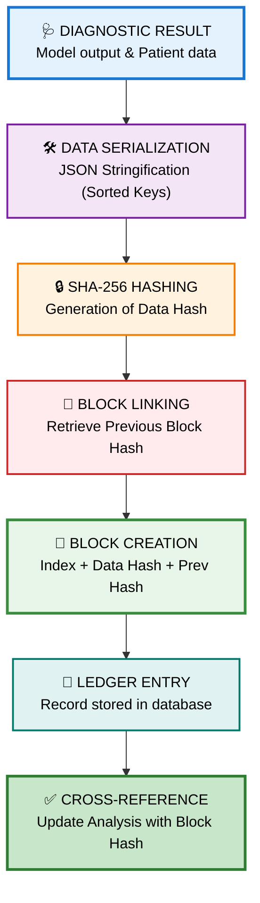
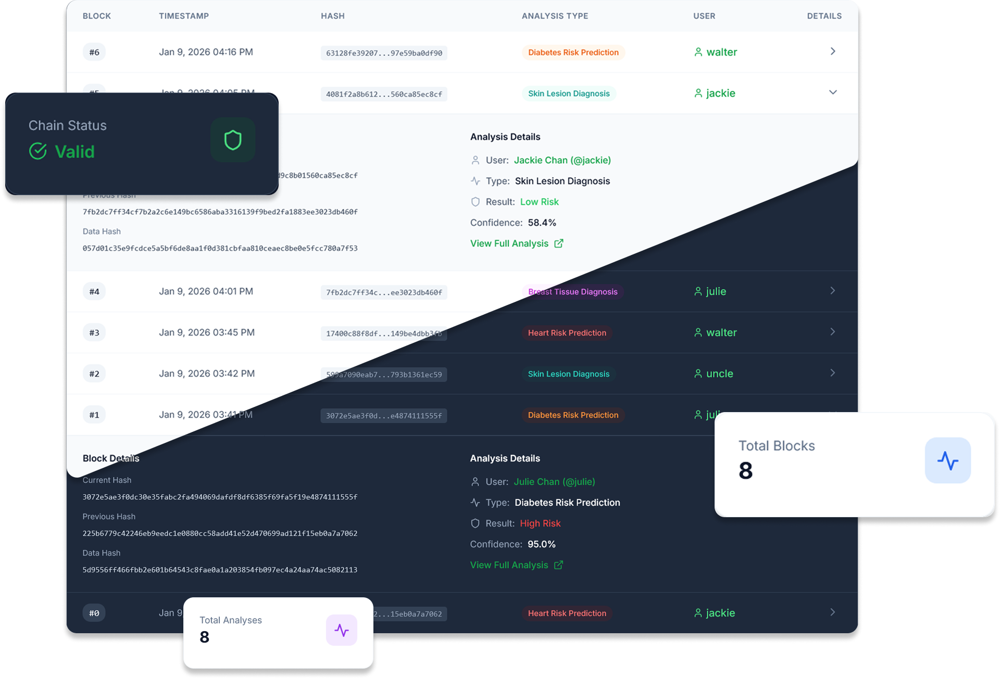

<div align="center">
  
</div>

<div align="center">
  <h1>Blockchain Security & Audit Trail</h1>
  <strong>Immutable Ledger for Medical Diagnostic Integrity</strong><br/>
  <em><a href="https://Krishna-Vijay-G.github.io">Krishna Vijay G</a> • Hygieia AI Healthcare Platform</em>
</div>

---

## 📋 Table of Contents

1. [System Overview](#-system-overview)
2. [Blockchain Workflow](#-blockchain-workflow)
3. [Architecture & Security](#-architecture--security)
4. [Hashing Mechanism](#-hashing-mechanism)
5. [Verification Process](#-verification-process)
6. [Dashboard & Monitoring](#-dashboard--monitoring)
7. [Technical Specifications](#-technical-specifications)
8. [Clinical Significance](#-clinical-significance)

---

## 🎯 System Overview

| Property | Value |
|----------|-------|
| **System Name** | Blockchain Audit Trail |
| **Technology** | SHA-256 Merkle-style Chaining |
| **Storage** | Relational Ledger (PostgreSQL) |
| **Access Control** | Admin-only Verification |
| **Purpose** | Data Integrity & Non-repudiation |

### Description

Hygieia implements a **Private Audit Trail Blockchain** to secure patient diagnostic records. Every analysis generated by the platform is permanently linked to a cryptographic block, ensuring that medical results cannot be tampered with or altered after generation. This creates a "trustless" verification layer for healthcare providers and patients.

### Key Features

- **Sequential Chaining**: Each block contains the hash of the previous block, creating an unbreakable chain.
- **Data Integrity**: Any change to the original diagnosis data invalidates the cryptographic hash.
- **Timestamped Records**: Precise UTC timestamps for every diagnostic event.
- **Admin Verification**: Built-in tools for system administrators to validate the entire ledger history.

---

## 🔄 Blockchain Workflow

The following diagram illustrates how clinical data moves from a diagnostic model into the immutable blockchain ledger.



---

## 🏗 Architecture & Security

### The anatomy of a Block

Each block in the Hygieia ledger consists of:

| Component | Description | Security Role |
|-----------|-------------|---------------|
| `Block Index` | Unique sequential number | Maintains ordering |
| `Timestamp` | UTC Time of creation | Temporal proof |
| `Data Hash` | SHA-256 of the Analysis payload | Proof of content |
| `Previous Hash` | Hash of block $N-1$ | Chain continuity |
| `Current Hash` | Final hash: $H(Index + DataHash + PrevHash)$ | Block identity |
| `Analysis ID` | Foreign key to patient record | Data linkage |

---

## 🔒 Hashing Mechanism

The system employs **SHA-256 (Secure Hash Algorithm 256-bit)** to generate unique identifiers. The hashing process is deterministic, meaning the same input will always produce the same hash, but even a single character change in the data will result in a completely different hash (Avalanche Effect).

### Data Protected by Hash

1. **Analysis ID**: Unique identifier of the test.
2. **User ID**: Owner of the medical record.
3. **Analysis Type**: The specific model used (e.g., Skin Diagnosis).
4. **Result Payload**: The actual clinical findings and confidence scores.
5. **Timestamp**: When the analysis was performed.

```python
# Conceptual Hashing Logic
data_to_hash = {
    'analysis_id': analysis.id,
    'user_id': analysis.user_id,
    'result': analysis.result,
    'timestamp': analysis.created_at
}
data_hash = hashlib.sha256(json.dumps(data_to_hash)).hexdigest()
```

---

## ✅ Verification Process

The integrity of the blockchain is maintained through a validation loop:

1. **Chain Traversal**: The system iterates through every block starting from the Genesis block (Index 0).
2. **Hash Recalculation**: For each block, the system re-computes the hash using the stored data and previous hash.
3. **Link Validation**: It verifies that `CurrentBlock.PreviousHash == PreviousBlock.CurrentHash`.
4. **Alerting**: If any mismatch is found, the system marks the chain as **COMPROMISED**, indicating data tampering.

---

## 📊 Dashboard & Monitoring

The Blockchain Dashboard provides real-time visibility into the health and status of the audit trail.

### Blockchain Explorer View

<div align="center">
  
</div>
*Figure 1: Administrative view of the blockchain ledger and verification status.*

### Dashboard Features
- **Ledger Explorer**: List of all blocks with their cryptographic hashes.
- **Verification Status**: One-click validation of the entire chain.
- **Detailed Inspection**: View the clinical data associated with any specific hash.
- **Audit Logs**: Track who accessed or verified the blockchain records.

---

## ⚙️ Technical Specifications

### Security Parameters

| Parameter | Specification |
|-----------|---------------|
| Algorithm | SHA-256 |
| Chaining | Hash-based Linking |
| Encoding | Hexadecimal |
| Immutability | Logic-enforced write-once |
| Encryption | AES-256 at REST |

### Implementation Stack

- **Backend**: Python 3.11 with Flask-SQLAlchemy
- **Cryptography**: Python `hashlib` library
- **Frontend**: Next.js 14 with Tailwind CSS
- **Visualization**: Mermaid.js for architecture diagrams

---

## 🏥 Clinical Significance

### Why Blockchain for Medical Data?

1. **Trust**: Patients can verify that their results haven't been changed by unauthorized parties.
2. **Accountability**: Every diagnostic event is logged with a permanent, time-stamped record.
3. **Audit Readiness**: Healthcare facilities are "always audit-ready" with a cryptographically verifiable history.
4. **Data Portability**: Hashes can be used to verify records across different health systems without exposing raw PII.

---

<p align="center">
  <strong>Blockchain Audit Trail v1.0</strong><br/>
  <em>Hygieia AI Healthcare Platform Security Section</em><br/>
  <a href="https://Krishna-Vijay-G.github.io">Krishna Vijay G</a>
</p>


